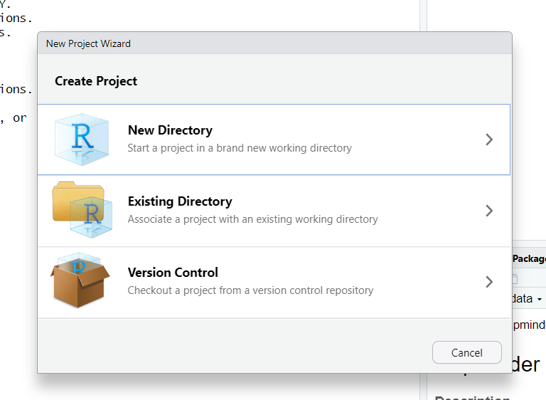
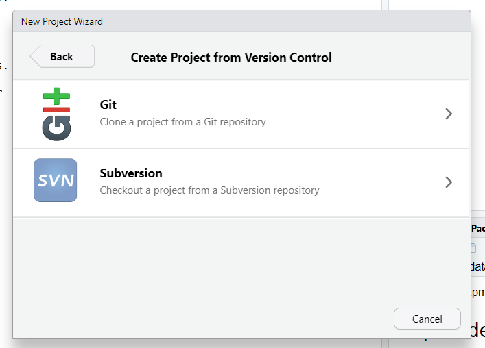
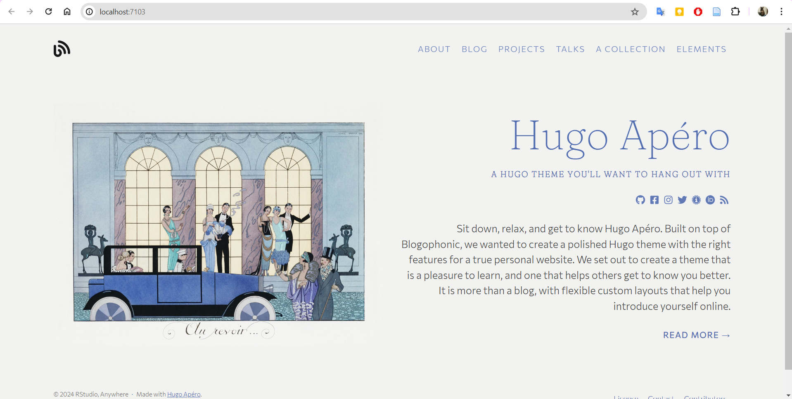

### “En este tutorial aprenderemos a crear un sitio web personal/blog”


# 1. Set up

Antes comenzar es importante tener las versiones más recientes de R y RStudio:

- R v>=3.6.0

- RStudio >= 1.4

También necesitaremos una cuenta de github y una forma de conectar RStudio con github.

## Conectar RStudio con GitHub


Por último necesitamos instalar lo siguiente:

- Instalar `blogdown`: `install.packages("blogdown")`

- Instalar Hugo: `blogdown::install_hugo()`, verificar que la versión sea una actual con `blogdown::hugo_version()`.

Y necesitamos saber un poquito de Markdown.

# 2. Crear tu sitio

## Crear un repo en GitHub

Lo primero que debemos hacer es crear un repositorio en github que alojará nuestra página web.





Crea un nuevo repositorio en github  <https://github.com/new>:

+ Inicializalo con un `README` 

+ No añadir un `.gitignore`- este se añadirá más tarde. 











Clonar el repositorio usando lo siguiente:

+ Dar click en el botón verde de <i class="fas fa-download fa-fw"></i>**Code**.

+ Seleccionar ya sea HTTPS o SSH según como sea su conección con RStudio y copiar el link.









## Crear un proyecto en RStudio


Debemos crear un proyecto en RStudio para poder hacer la conexión con GitHub. 
En primer lugar clonaremos el repositorio para trabajar de manera local.

  1. Abrir RStudio.
  2. Luego, en el menú `File` hacer click en `New Project`.
  3. En la ventana que se abre, hacer click en `Version Control`.
    
  4. Después hacemos click en `Git`.
    
  5. Copiar la url del repositorio que deseamos clonar.
    
  6. Pegar la url en la ventana de RStudio. Cambiar el nombre del directorio (si así lo deseamos), elegir la carpeta donde se va a guardar el clón del repositorio. Marcar `Open in new session` para que el proyecto utilice su propia sesión de `R`.
    
    Y presionar en `Create Project` para que se cree el nuevo proyecto.


Una vez realizado lo anterior ya se puede trabajar dentro del proyecto.

    
## Crear el sitio web




Vamos a usar blogdown para crear un sitio web con el tema de Hugo Apéro. En la consola de RStudio realizamos lo siguiente:


```r
> library(blogdown)
> new_site(theme = "hugo-apero/hugo-apero", 
           format = "toml",
           sample = FALSE,
           empty_dirs = TRUE)
```

Nos saldrá un mensaje que pregunta si queremos visualizar el ejemplo del sitio, colocar `y`.




```r
― Creating your new site
| Installing the theme hugo-apero/hugo-apero from github.com
trying URL 'https://github.com/hugo-apero/hugo-apero/archive/main.tar.gz'
downloaded 21.3 MB

| Adding the sample post to content/blog/2020-12-01-r-rmarkdown/index.Rmd
| Converting all metadata to the YAML format
| Adding netlify.toml in case you want to deploy the site to Netlify
| Adding .Rprofile to set options() for blogdown
― The new site is ready
○ To start a local preview: use blogdown::serve_site(), or the RStudio add-in "Serve Site"
○ To stop a local preview: use blogdown::stop_server(), or restart your R session
► Want to serve and preview the site now? (y/n)
```












Nos preguntará si queremos tener un preview del sitio web:

```r
► Want to serve and preview the site now? (y/n)
```

Seleccionamos `y` y dejamos que blogdown cree el sitio. Esto nos abrirá en el panel inferior derecho la pestaña Viewer, pero no solo podemos visualizarlo ahí:


Da click en el icon  <i class="fas fa-external-link-alt"></i> *Show in new window* (a la derecha del símbolo :broom:) para previsualizarlo en un navegador. 








    
Lo que resta es comenzar a configurarlo :rocket:


### Actualizar el tema

NOTA: USAR CON PRECAUCIÓN LO SIGUIENTE.

Para actualizar un tema dentro del mismo sitio usamos lo siguiente, cambiando el tema por alguno de los disponibles:

- [TEMAS DISPONIBLES](https://themes.gohugo.io/)

```r
blogdown::install_theme(theme = "hugo-apero/hugo-apero",
                        update_config = FALSE, 
                        force = TRUE)
```

### Convertir/Cambiar tema de un sitio existente 

NOTA: USAR CON PRECAUCIÓN LO SIGUIENTE.

Una vez creado un sitio web podemos cambiar el tema, en el siguiente link se encuentran los pasos a seguir.

[link](https://silviacanelon.com/blog/2021-06-01-hello-hugo-apero/)


# 3. Configurar tu sitio

Ahora, solo tenemos que configurar el sitio.


## Variables de Hugo

Algunas variables a configurar de Hugo se encuentran en el archivo `config.toml`La lista completa de variables esta en [Hugo docs](https://gohugo.io/getting-started/configuration/#all-configuration-settings). Las que podemos comenzar a editar son:

```toml
baseURL = "/"
title = "R-Ladies Morelia"
author = "Haydeé Peruyero"
# set deliberately low for testing- choose your preferred number 
paginate = 5
```


## Apéro variables

Existen varias variables de Apéro globales que tal vez nos interese modificar. Todas se encuentran después de la sección `[params]` en el archivo `config.toml`. Las más importantes son:

```toml
[params]
  orgName = "RStudio"
  orgLocal = "Anywhere"
  description = "A modern, beautiful, and easily configurable blog theme for Hugo."
  favicon = "/img/favicon.ico"
  logo = "/img/blogophonic-mark-dark.png"
  mainSections = ["blog", "project", "talk"]
  navallcaps = true
  # Default image for social sharing and search engines. 
  # Place image file in `static` folder and specify image name here.
  sharing_image = "/img/papillons.jpg"
  # Twitter username (without @). Used when a visitor shares your site on Twitter.
  twitter = "apreshill"
```

Todas las imágenes las deberíamos poner en un folder llamado `/static/img/` (`favicon`, `logo`, y `sharing_image`) en la raiz del proyecto.

```bash
config.toml
static/
└── img/
    ├── favicon.ico 
    ├── blogophonic-mark-dark.png
    └── papillons.jpg
```

## Color del tema

Existen tres formas de cambiar el tema

+ Usar un [color de tema](/learn/color-themes/#use-a-color-theme),
+ Usar [Tachyons colors](/learn/color-themes/#use-tachyons-named-colors), o
+ Personalizar con [hex codes](/learn/color-themes/#bring-your-own-hex-codes).

Esta sección se encuentra también el archivo `config.toml`.

```toml
[params]
  # use a built-in color theme
  # one of: forest / grayscale / peach / plum /
  #         poppy / sky / violet / water
  theme = "peach"
  
  # or, leave theme empty & make your own palette
  # see docs at https://hugo-apero.netlify.app/learn/color-themes/
  # the custom scss file must be in the assets/ folder
  # add the filename name here, without extension
  # to use hex colors instead of named tachyons colors, include "hex" in filename
  custom_theme = "hex-colors" 
```

La documentación completa esta en el [link](/learn/color-themes/).

## Tipos de letra

Existen también tres formas de configurar esto:

+ Usar [embedded fonts](/learn/fonts/#embedded-fonts),
+ Usar [system fonts](/learn/fonts/#use-attractive-system-fonts), o
+ Usar [custom fonts](/learn/fonts/#use-a-custom-font).

Se encuentra en el archivo `config.toml`:

```toml  
[params]
  # use an embedded font
  customtextFontFamily = "Commissioner"
  customheadingFontFamily = "Fraunces"
  
  # or choose a system font stack
  textFontFamily = "sans-serif"
  headingFontFamily = "serif"
```

[Documentacón completa](/learn/fonts/).

## Social icons

Se pueden usar ambos Font Awesome y Academicons como link a sus redes sociales.

En el archivo `config.toml` se encuentra en la sección:

```toml
[params]
  # show/hide social icons in site header & footer
  socialInHeader = false
  socialInFooter = false
  
  [[params.social]]
      icon      = "github" # icon name without the 'fa-'
      icon_pack = "fab"
      url       = "https://github.com/apreshill/apero"
  [[params.social]] <!--lather, rinse, repeat-->
```

[Documentación](/learn/social/).

## Menus

Los menus/pestañas de nuestro sitio los configuramos en el archivo `config.toml` en la sección:

```toml
[menu]
  [[menu.header]]
    name = "About"
    title = "About Apéro"
    url = "/about/"
    weight = 1
  [[menu.header]] <!--lather, rinse, repeat-->
```

Y también para los pies de página:

```toml
  [[menu.footer]]
    name = "License"
    title = "License"
    url = "/license/"
    weight = 1
  [[menu.footer]] <!--lather, rinse, repeat-->
```


